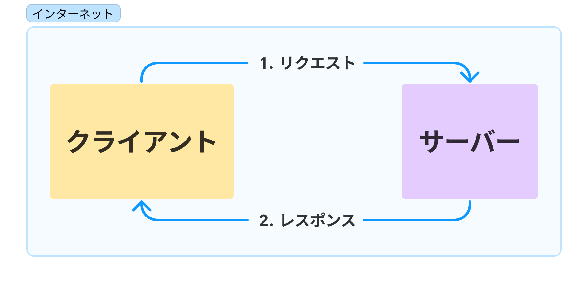
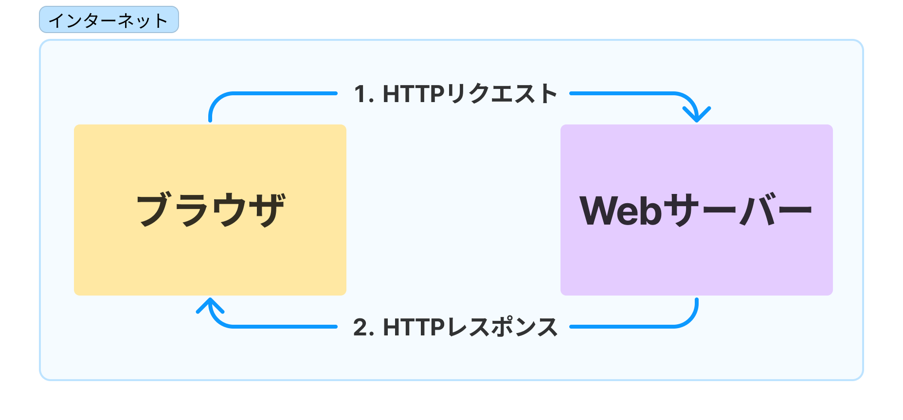
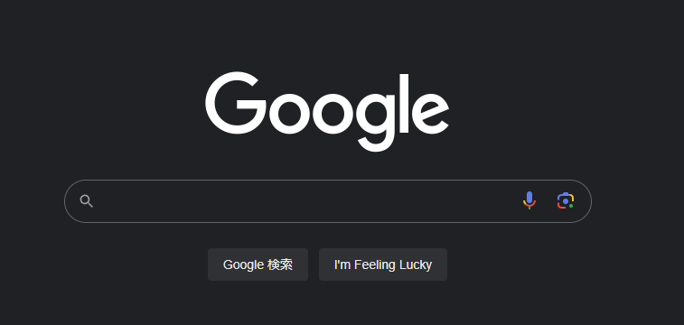
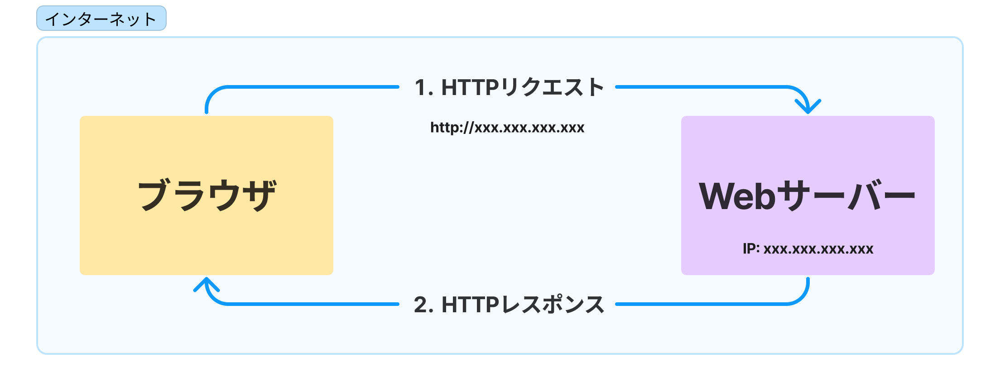
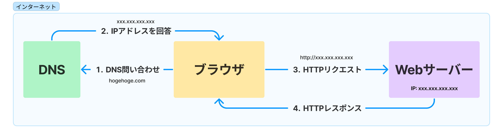

# Webの仕組み

では、早速Webの仕組みについて学んでいきましょう。
インターネットは世界で最も大きいコンピュータ同士の通信網で、Webはインターネット上で情報を扱うシステムの一つである。

> [!TIP]
> 厳密に説明すると分量が多くなるため、簡略化して説明している場所が多数あります。

## Webの世界における通信を理解する

### クライアントとサーバー

Webの世界では一般に、インターネットに接続された端末の間で図1のようなやり取りが行われます。

図1: クライアントとサーバのやり取り

クライアント: ユーザーが利用するコンピュータやソフトウェアのこと。 例: Webブラウザ、スマートフォンアプリケーション
サーバー: クライアントに対してサービスを提供するコンピュータやソフトウェアのこと。 例: Webサーバー

基本的には、クライアントが何らかの要求(:=リクエスト)をサーバーに送信し、サーバーはその要求に対して何らかの応答(:=レスポンス)を返します。 
また、その送受信はインターネットを介して行われます。

### 通信のしくみ

Webの世界では、クライアントとサーバーはHTTP (Hypertext Transfer Protocol) というプロトコルを使って通信を行います。

> [!TIP]
> プロトコルとは、通信の際にどのような形式でデータを送受信するかを定めた規約のことです。
>
> Ⅰ・Ⅱ類ではコンピュータネットワークという講義で学ぶ内容です。

一般的にWebサイトのURLが`http://`や`https://`で始まるのは、HTTPプロトコルで通信を行うことを意味しています。 
※あとでもう少し丁寧に説明します。

なお、HTTPSはプロトコルではなく、あくまでもHTTPプロトコルのまま通信の暗号化を行っているものです。

#### HTTPプロトコルの特徴

1. テキストベースのプロトコル
   - テキストデータをやり取りするため、デバッグがしやすい
   - 人間が読める
2. ステートレス
   - すべてのリクエスト・レスポンスは独立している
   - 前のリクエストの情報は一切保持されない

> [!TIP]
> ステートレスの対義語はステートフル

---

さて、ここまで分かった内容をまとめるとこういう状態です。では先に進みます。

## Webサイトが表示できる理由

### WebサーバーとIPアドレス、URL

#### Webサーバーとは

Webサーバーは、ざっくり説明すると次の2点を満たしています。

1. Webサイトのコンテンツ(HTML,CSS,画像など)のデータを保持している
2. HTTPリクエストとURLを理解できるソフトウェアが動作している
   - 一般にHTTPサーバーと呼ばれるもの

実際には次のような流れでWebサイトが表示されます。

1. Webブラウザから送信されたHTTPリクエストがWebサーバーに到達すると、Webサーバーはそのリクエストを解釈する。
2. リクエストされた文書・ファイルをレスポンスとして返却する(HTMLファイルなど)。
3. ブラウザがレスポンスを受け取り、それを解釈してページを表示する。

**...なぜHTTPリクエストがWebサーバーに到達できるのでしょうか？**

それは、Webサーバーには基本的にIPアドレスが割り当てられているからです。 

#### IPアドレスとは

IPアドレスとは、インターネット上のコンピュータを識別するための番号のことです。インターネットにおける**郵便番号**ともいえます。

IPアドレスの正確な定義は次の通りです。

> IP アドレスはネットワークに接続された、インターネットプロトコル(IP) を使うすべての端末に割り当てられる番号です。 
> <https://developer.mozilla.org/ja/docs/Glossary/IP_Address>

ということになっています。

> [!IMPORTANT]
> ここでIPアドレスを「住所」ではなく「郵便番号」と表現しています。
>
> この理由はのちほど説明します。

一般的にIPアドレスは、IPv4と呼ばれる形式のものを指しています。
`xxx.xxx.xxx.xxx`のような形式で表現され、各セクションは0から255までの数字で表現されます。

インターネットプロトコルの話を始めると長くなってしまうので今回の講習では割愛しますが、
調べてみると面白いです。

---

さて、先ほどIPアドレスのことを「郵便番号」と表現しました。

郵便番号だけ分かっても手紙を目的の人物に届けることはできないように、IPアドレスだけではWebサーバーにリクエストするコンテンツを指定することはできません。

そこで、URLという文字列が使われます。

#### URLとは

URLとは、インターネット上にある固有なリソースを指し示すための文字列です。 
<http://172.217.175.110>のような文字列が相当します。

URLの詳細については、MDNの資料が大変良くできているため、こちらを閲覧してください。 
<https://developer.mozilla.org/ja/docs/Learn/Common_questions/Web_mechanics/What_is_a_URL>

#### IPアドレスを使ってWebサイトにアクセスしてみる

さて、URLを理解したということは、Webサイトにアクセスする方法も理解できたということです。 
ブラウザを開いてアドレスバーに`http://172.217.175.110`と入力してみてください。

Googleのトップページが表示されたのではないでしょうか？ 
これは、GoogleのWebサーバーにアクセスするためのIPアドレスを直接指定したためです。

さて、ここまでの内容をまとめるとこういう状態です。
少しだけ分かることが増えましたね。では先に進みます。

---

### ドメイン名とDNS: なぜ我々はIPアドレスを覚えなくてよいのか

先ほどGoogleにIPアドレスを指定してアクセスしていただきましたが、みなさんが普段GoogleにアクセスするときにわざわざIPアドレスを指定しているということはないはずです。 
かわりに`google.com`や`google.co.jp`などの文字列(ドメイン名と呼ばれる)を指定してアクセスしていると思います。

しかし、HTTPリクエストの原則上WebサーバーにはIPアドレスを指定しないとアクセスできないということは変わりません。 
ということは、**何らかの方法でドメイン名をIPアドレスに変換している**ということになります。

その「何らか」がDNS(Domain Name System)です。

#### DNSとは

ドメイン名とIPアドレスの対応関係を管理しているのがDNSです。
たとえば、`google.com`というドメイン名は`172.217.175.110`というIPアドレスに対応している、という情報をDNSが持っています。

Webブラウザは、まずDNSに問い合わせを行い、ドメイン名に対応するIPアドレスを取得します。 
こうすることで、`google.com`というドメイン名を指定するだけでGoogleのWebサーバーにアクセスできるのです。

ここまでの内容をまとめるとこういう状態です。

**これが、実際に我々がURLを入力してWebサイトを表示するときに起こっていることです。**

## まとめ

ここまで到達したあなたは、おおむね「ブラウザでURLを入力してWebサイトを表示するとき、何が起こっているのか？」について答えられるはずです。

1分ほど考えてみてください。

答えがわかったらここをクリックしてください

1. Webブラウザは、URLに指定されたドメイン名をDNSに問い合わせ、対応するIPアドレスを取得する。 
2. Webブラウザは、取得したIPアドレスにHTTPリクエストを送信する。 
3. Webサーバーは、リクエストされたコンテンツをレスポンスとして返却する。 
4. Webブラウザは、レスポンスを受け取り、それを解釈してページを表示する。 

