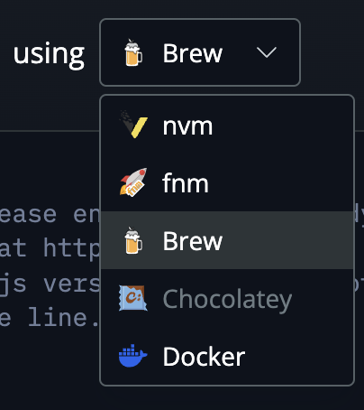

# Node.jsの環境構築

Node.jsとは、JavaScriptをサーバーサイドで実行するためのランタイム(実行環境)です。
これによって、HTTPサーバーなどをJavaScriptで記述できるようになります。

## インストール

### Windowsの場合

1. <https://nodejs.org/en/download/prebuilt-installer>にアクセスします。
2. Windows Installerをダウンロードします。
3. ダウンロードしたファイルを実行し、インストールします。
4. 特に変更せずインストールを行います。

### macOSの場合

1. <https://nodejs.org/en/download/package-manager>にアクセスします。
2. 一番右のusingでHomebrewを選択します。 
3. 下のテキストボックスに表示されている内容をコピーし、macOSのターミナルを起動して実行します。

### そのあと

1. ターミナルを開いて、`node -v`と入力します。
   - `v20.14.0`のようなバージョン番号が表示されれば成功です。
2. `npm -v`と入力します。
   - `10.7.0`のようなバージョン番号が表示されれば成功です。

> [!TIP]
> もし表示されなければ、PCの再起動を試してみてください。
>
> それでも表示されなければTAを呼んでください。
